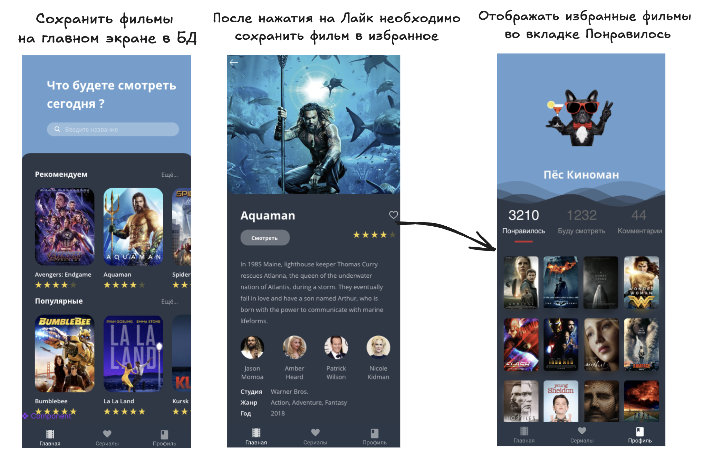

# Домашнее задание

### 🎯 Цели домашнего задания:

- Ознакомиться с кэшированием данных через Room.
- Реализовать подход Offline-first.
- Научиться создавать связи 1 ко многим, многие ко многим.
- Научиться работать с миграциями.
- Научиться тестировать миграции БД.

### 📚 Задание

Все методы можно реализовывать через RxJava, в дальнейшем мы будем использовать корутины

- Создать необходимые Entity, Dao, Database
- Сохранить фильмы на главном экране в локальную БД
- Реализовать метод для сохранения фильмов, которые понравились пользователю на детальном экране
- Показывать фильмы из БД на странице Понравилось
- Сохранить фильмы, которые получаем на главной странице now_playing, popular etc.
- Построить отношение 1 ко многим/многие ко многим (на выбор)
- - Реализовать отношение многие ко многим фильмов и актеров
- - Реализовать отношение один ко многим: один фильм и много жанров.

### 👨‍💻 Исходный код примеров из вебинара:

- [Отношение 1 ко многим](https://github.com/AndroidStudentClub/Room-Relations/tree/feature/1-to-many)
- [Многие ко многим](https://github.com/AndroidStudentClub/Room-Relations/tree/feature/many-to-many)
- [Миграции](https://github.com/AndroidStudentClub/Room-Migration)

### 📚 Полезные материалы:
- Используем join в SQLite-запросах Room для android (https://habr.com/ru/articles/570400/)
- Работа LRU (https://www.youtube.com/watch?v=R5ON3iwx78M)
- Каскадное удаление (https://developer.android.com/reference/androidx/room/ForeignKey#constants_1)

