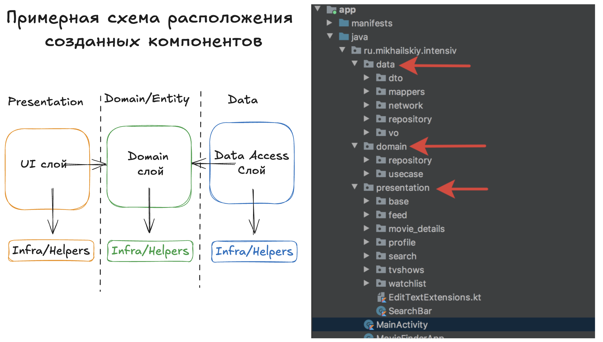

# Домашнее задание

### 🎯 Цели домашнего задания:

- Освоить принципы Clean Architecture
- Реализовать разбиение на слои согласно Clean Architecture
- Создать Repository, Interactors, UseCases, DataSource и другие необходимые компоненты
- Научиться работать с MVP

### 📚 Задание

- Создать 3 packages: Data, Domain, Presentation. Распределить имеющиеся компоненты в соответствующие слои
- Создать интерфейсы репозиториев для фильмов/актеров/сериалов. 
- Реализовать методы интерфейса репозиториев.
- Создать необходимые DataSource, например LocalDataSource для работы с данными, NetworkDataSource для работы с API
- Создать необходимые UseCase для получения фильмов/сериалов/актеров
- Создать конверторы (mappers) задача которых конвертация из DTO->Domain
- Опционально (если вы никогда не работали с MVP). Реализовать MVP на экране отображения списка ТВ-сериалов 

### 📚 Полезные материалы:
- [Статья про заблуждения Clean](https://habr.com/ru/company/mobileup/blog/335382/)
- [Пример проекта из презентации Ветка mvp-and-clean](https://github.com/AndroidStudentClub/IntensivStar/tree/feature/mvp-and-clean)
- [Статья про Clean Architecture в Android](https://fernandocejas.com/2014/09/03/architecting-android-the-clean-way/)
- [Статья про MVP в Android](https://habr.com/ru/company/rambler_group/blog/275943/)

### 👨‍💻 Исходный код примеров из вебинара:
- [Репозиторий с примером из этой же статьи](https://github.com/android10/Android-CleanArchitecture)

