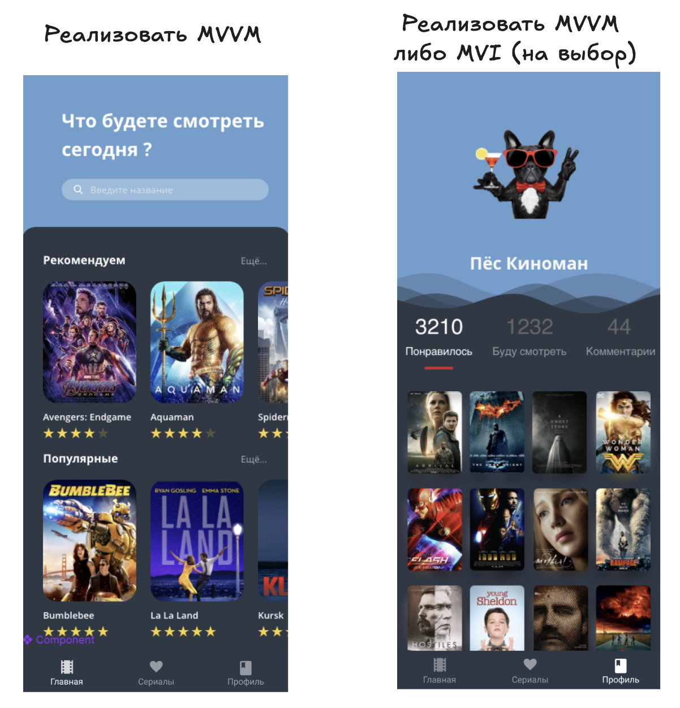

# Домашнее задание

### 🎯 Цели домашнего задания:

- Освоить принципы работы MVVM
- Использовать Android Architecture Components: LiveData/StateFloe, ViewModel для реализации MVVM
- Освоить принципы работы MVI

### 📚 Задание

- Реализовать MVVM на главном экране (FeedFragment)
- Реализовать MVVM на экране списка понравившихся фильмов (3-я вкладка)
- Опционально: использовать MVI на практике на экране списка понравившихся фильмов (вместо MVVM)

### 📚 Полезные материалы:
- [Сравниваем готовые решения для реализации MVI-архитектуры на Android](https://habr.com/ru/companies/simbirsoft/articles/661185/)
- [Статья про MVI](https://swiderski.tech/2024-02-24-MVI/)
- [Modern MVI и MVVM+ со всех сторон в 2023](https://www.youtube.com/watch?v=Ly_uiB8kYs8)
- [Доклад.Как приготовить хорошо прожаренный MVI под Android](https://mobiusconf.com/archive/2018%20Moscow/talks/2b29ltvghmoyay0wyogwyo/)

### 👨‍💻 Исходный код примеров из вебинара:
- [Репозиторий с примером](https://github.com/AndroidStudentClub/MVI-Demo)

