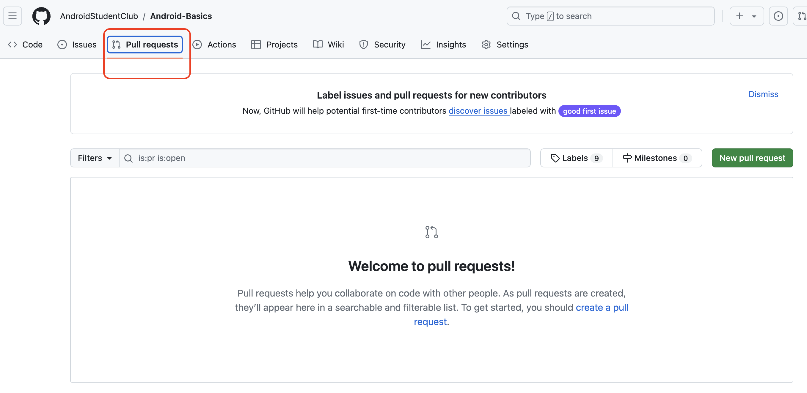
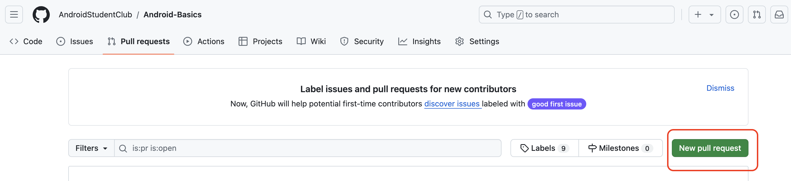
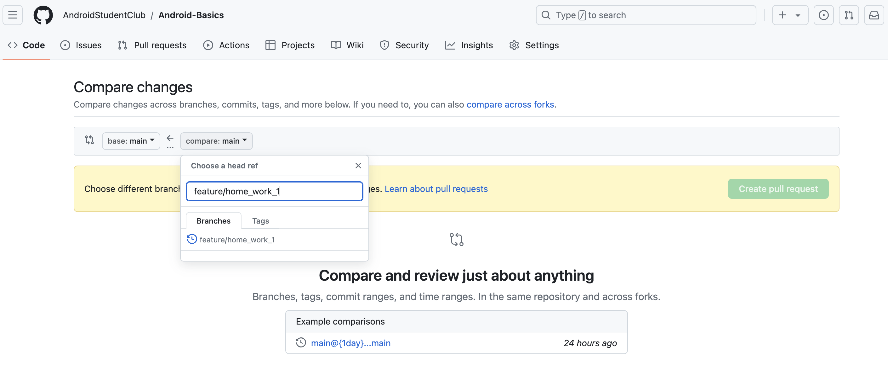
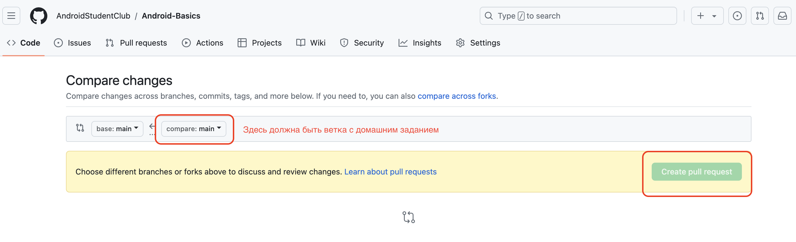

# Оформление домашних заданий

<aside>
💡 На этой странице описан процесс отправки домашних заданий для проверки наставником

</aside>

# 1. Создать ветку от ветки `master`

Следует использовать следующий вариант именования feature/home_work_N

Где N - номер домашнего задания, например feature/home_work_1

# 2. Выполнить домашнее задание

Домашнее задание выполняется в новой ветке, например feature/home_work_1
Чтобы создать новую ветку необходимо выполнить команду

```html
git checkout -b new-branch-name (new-branch-name - имя ветки)
```

После выполнения домашнего задания обязательно сделать комит изменений

```html
git commit -m “Описание сделанных изменений”
```

и отправить изменений на удаленный репозиторий

```html
git push origin feature/home-work-1
```

# 3. Создать Pull Request на Github

### Для этого на GitHub выберите пункт Create Pull Request





### Выберите ветку с выполненным домашним заданием



### Нажмите Create Pull Request



# 4. Отправить на code review

После оформления Pull Request нужно скинуть ссылку в личку куратору для проверки

# 5. Выполнить правки по code review

После проверки вашего домашнего задания необходимо выполнить исправление комментариев куратора в той же ветке, что и домашнее задание. После этого сделать комит изменений и отправить на GitHub.
После того, как вы отправили исправление на удаленный репозиторий, нужно второй раз отправить ссылку на проверку куратору курса если замечаний было много, для того, чтобы куратор проверил что все исправлено правильно. Если замечаний было не много и они были не критичные - то можно после того, как вы исправили замечания их смёржить в ветку мастер самостоятельно через интерфейс GitHub.

### Code Style

- [Kotlin Code Style](https://developer.android.com/kotlin/style-guide#import_statements)

### 📚 Полезные материалы:

- [Интерактивный самоучитель по Git](https://learngitbranching.js.org/?locale=ru_RU)
- [Гайд Start a new git repository](https://kbroman.org/github_tutorial/pages/init.html)
- [Создать репозиторий GitHub](https://medium.com/@breadcrumbszone/%D1%81%D0%BE%D0%B7%D0%B4%D0%B0%D1%82%D1%8C-%D1%80%D0%B5%D0%BF%D0%BE%D0%B7%D0%B8%D1%82%D0%BE%D1%80%D0%B8%D0%B9-github-71ebe3ace9b2)
- [Как залить проект на GitHub](https://skillbox.ru/media/code/instruktsiya_zalivaem_proekt_na_github_bez_komandnoy_stroki/)